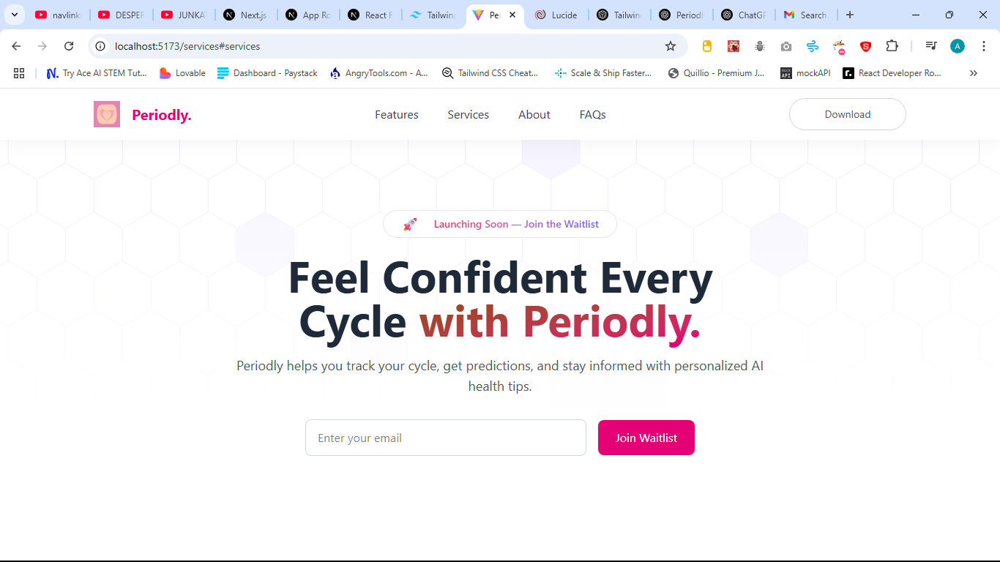

# 🚀 Periodly Launch Website

A modern product launch website built with **React**, **Tailwind CSS**, and **TypeScript** to promote the Periodly app — a smart, clean solution for cycle tracking.


Live URL: https://periodly.netlify.app/

## 📌 Table of Contents

- [🚀 Getting Started](#-getting-started)
- [🛠 Tech Stack](#-tech-stack)
- [📦 Setup & Run Instructions](#-setup-run-instructions)
- [💻 Running the Application](#-running-the-application)
- [📋 Approach](#-approach)
- [📸 Screenshots](#-screenshots)
- [🚀 Deployment](#-deployment)
- [👤 Author](#-author)

## 🚀 Getting Started

## 🛠 Tech Stack

- ⚛️ React (Vite)
- 🔐 TypeScript
- 💅 Tailwind CSS
- 🎨 Lucide React (icon library)
- 🔁 React Router DOM

## 📦 Setup & Run Instructions
1. **Clone the repository**

   ```bash
   git clone https://github.com/ruebeniosdev/periodly_launch
   cd periodly_launch


2. **Install dependencies**


npm install


### Running the Application
Start the development server:

npm run dev

Navigate to http://localhost:5173 in your browser. The app supports hot reload, so changes will update automatically.

### 📸 Screenshots



### 📋 Approach
✅ Project Setup
Vite + React + TS initialized

Tailwind configured for fast styling

Folder structure organized into components/, pages/, and assets/

✅ Application Features
Hero section with email waitlist form

Responsive navigation with React Router

Reusable UI components (Navbar, Footer, FAQs)

Mobile-friendly design


-  Git Workflow
Deployed via Netlify or Vercel (recommended for React/Vite apps).

To deploy manually, push your code to GitHub and connect your repo to Netlify/Vercel.

### Project Setup


### 👤 Author
Akankobateng Rueben Ansoliwen
Ghana | IOS Developer | Learning React 
